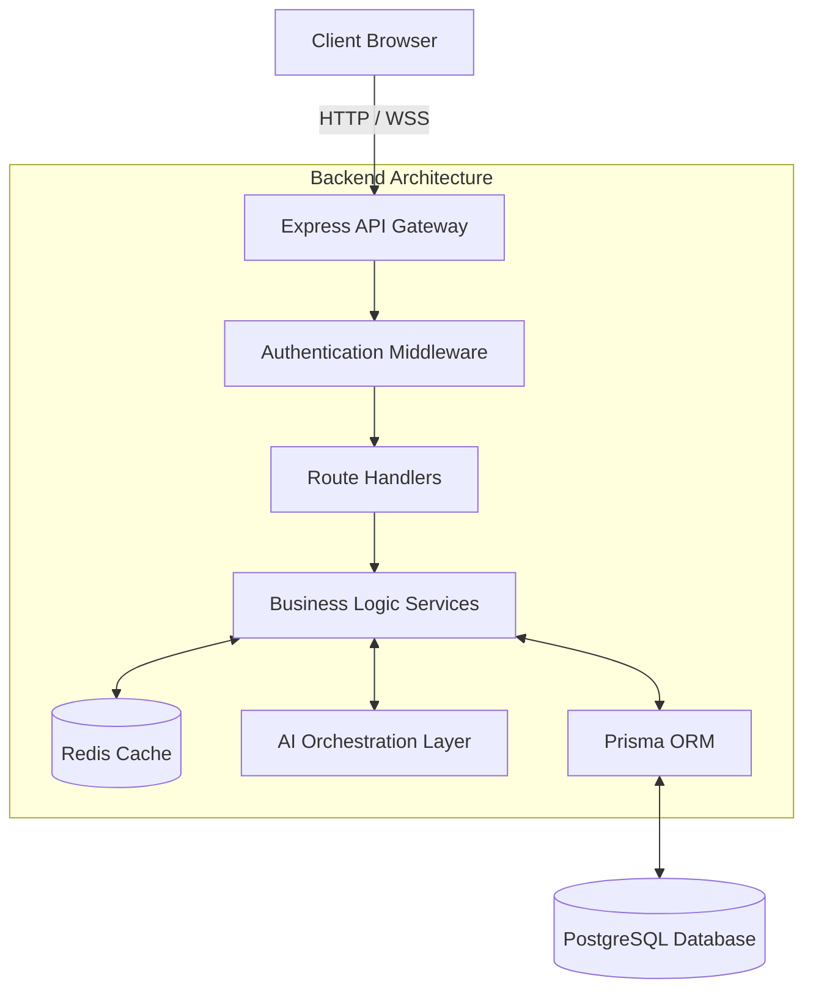
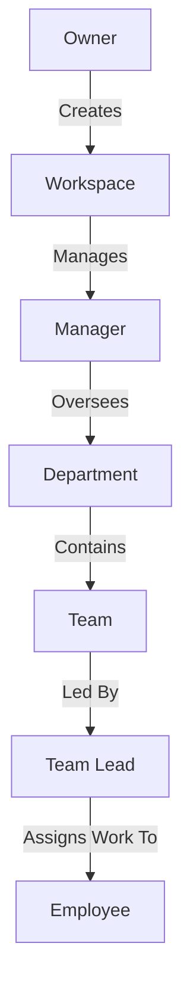
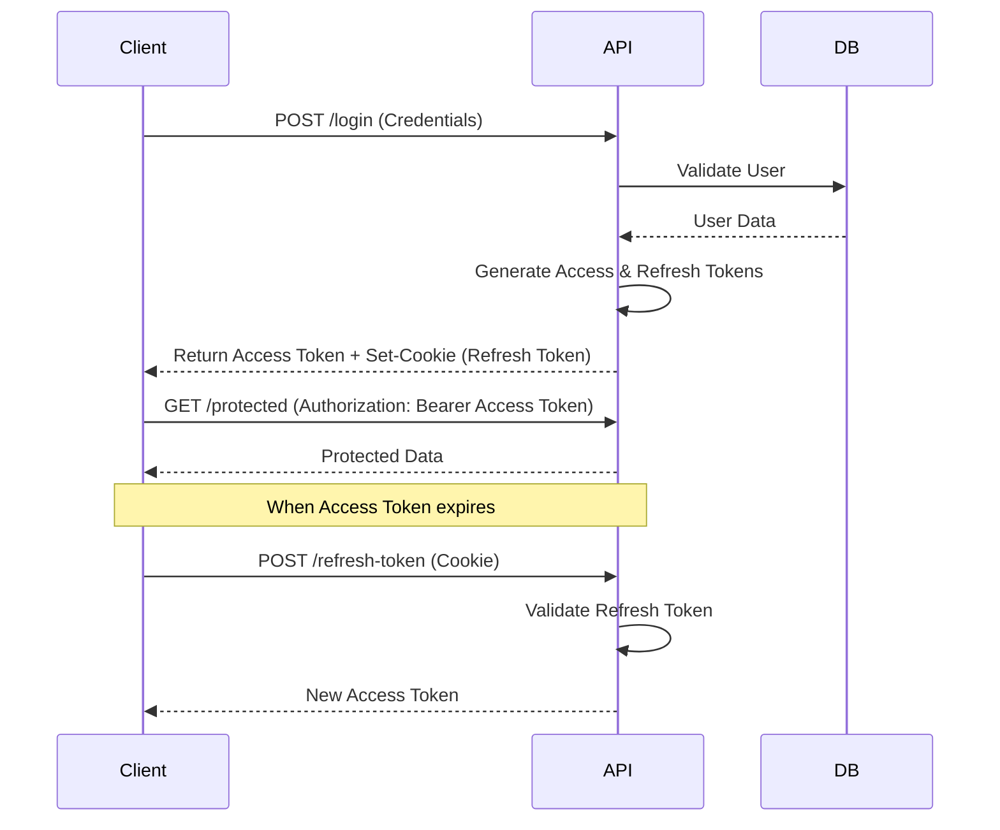

# Synapse

AI-powered Enterprise Workspace & Project Management Platform designed for hierarchical organizations, real-time collaboration, and intelligent workflow orchestration.

## Project Overview

Synapse was built to address the complexities of managing deeply hierarchical organizations where task orchestration, resource allocation, and communication often become fragmented. Traditional project management tools frequently struggle to map directly to enterprise structures—often forcing companies to adapt their workflows to the software. Synapse flips this paradigm by offering a strictly enforced, multi-tier organizational model that mirrors real-world corporate hierarchies while providing seamless downward delegation and upward reporting.

At its core, the platform integrates artificial intelligence directly into the planning phase of the project lifecycle. Rather than treating AI as a separate chatbot, Synapse embeds intelligent context-aware suggestions throughout the platform. This enables leaders to automatically decompose high-level objectives into granular, actionable work items distributed across the correct teams and departments. 

Designed as a production-grade distributed system, the architecture focuses on scalability, real-time state synchronization, and strict data isolation. By leveraging a modern stack built around Node.js, Redis, and PostgreSQL, the system is capable of handling concurrent workspace updates, real-time notifications, and high-frequency state changes without compromising on security or data integrity.

## Key Highlights

- Multi-tenant workspace architecture with strict data isolation.
- Hierarchical Role-Based Access Control (RBAC) ensuring explicit permission boundaries.
- AI-powered task decomposition and intelligent project orchestration.
- Real-time notification and event synchronization using Socket.IO.
- Redis-backed caching layer for high-throughput data retrieval.
- Secure JWT authentication with refresh token rotation and HTTP-only cookies.
- Robust relational data modeling using PostgreSQL and Prisma ORM.
- Production-ready deployment pipeline distributed across edge and cloud providers.

## System Architecture



## Platform Hierarchy



## Core Features

### Workspace Management
- Complete multi-tenant isolation ensuring organizational data is strictly siloed.
- Centralized dashboard for organizational oversight and health metrics.
- Streamlined onboarding and invitation system for workspace members.

### Project Management
- Deeply nested task delegation (Projects → Tasks → Subtasks → Work Items).
- Centralized tracking of deadlines, priorities, and completion statuses.
- Automated progress aggregation bubbling up from granular work items to the project level.

### AI Features
- Context-aware generation of organizational structures.
- Intelligent breakdown of complex tasks into manageable subtasks.
- Workload and resource allocation recommendations.

### Real-Time Features
- Instantaneous delivery of system events and priority alerts via WebSockets.
- Live synchronization of task status updates across active client sessions.
- Asynchronous background job processing and status propagation.

### Security Features
- Granular RBAC enforcing strict authorization at every API boundary.
- Stateless authentication mechanism protecting against CSRF and XSS attacks.
- Robust input validation and parameterized database queries to prevent SQL injection.

## AI Capabilities

Synapse tightly couples AI with enterprise planning. The platform utilizes advanced language models to offer contextual assistance:
- **Department Suggestions:** Analyzes workspace goals to recommend an optimal departmental structure.
- **Team Suggestions:** Suggests specialized teams required to execute specific departmental mandates.
- **AI Task Generation:** Converts high-level project requirements into distinct, assignable tasks.
- **AI Subtask Generation:** Breaks down complex tasks into technical subtasks suitable for team delegation.
- **AI Work Item Generation:** Generates granular, actionable work items with time estimates for individual employees.
- **Employee Performance Analysis:** Synthesizes completion metrics, overdue tasks, and workload to provide actionable leadership insights.

## Authentication & Security

Security is managed via a robust token-based authentication system. The platform employs short-lived Access Tokens for API authorization and long-lived Refresh Tokens stored in secure, HTTP-only cookies to handle session persistence without exposing sensitive credentials to the client-side JavaScript environment.



## Engineering Decisions

### Why PostgreSQL over MongoDB?
The organizational hierarchy of Synapse relies heavily on strict relational data. Projects, Departments, Teams, Tasks, and Users have complex, interconnected relationships that require ACID compliance and foreign key constraints. PostgreSQL ensures data integrity across deeply nested records, which would be prone to inconsistency in a document-based NoSQL database.

### Why Prisma?
Prisma provides type-safe database access and excellent developer ergonomics. In a complex schema with numerous relations, Prisma's ability to generate a highly predictable, strongly typed client significantly reduces runtime errors. Its schema definition file also serves as an excellent single source of truth for the data model.

### Why Redis?
To minimize database hits for frequently accessed, read-heavy operations—such as calculating organizational analytics or fetching hierarchical structures—Redis is utilized as an in-memory caching layer. This drastically improves response times and reduces the load on the primary PostgreSQL instance during peak traffic.

### Why Socket.IO?
Polling for updates in a project management tool creates unnecessary network overhead and latency. Socket.IO establishes a persistent, bi-directional WebSocket connection, allowing the server to push critical updates (like task assignments or priority alerts) to the client instantaneously. It also provides built-in fallback mechanisms for restricted networks.

### Why React + Vite?
React's component-based architecture is ideal for building dynamic, state-heavy dashboards. Combined with Vite, the frontend benefits from significantly faster Hot Module Replacement (HMR) and optimized build times compared to traditional bundlers like Webpack, leading to a much smoother developer experience and highly performant production bundles.

### Why Multi-Tenant Architecture?
Synapse is designed for B2B enterprise use. A multi-tenant architecture ensures that a single deployed instance can serve multiple distinct organizations while keeping their data completely logically isolated. This approach simplifies infrastructure maintenance and deployment while maintaining strict security boundaries.

## Technology Stack

| Layer | Technology |
|---|---|
| **Frontend** | React, Vite, Tailwind CSS |
| **Backend** | Node.js, Express.js |
| **Database** | PostgreSQL, Prisma ORM |
| **Cache & State** | Redis |
| **Real-Time** | Socket.IO |
| **Media Storage** | Cloudinary |
| **AI Integration** | OpenRouter |

## Folder Structure

```
synapse/
├── backend/
│   ├── prisma/             # Database schema and migrations
│   ├── src/
│   │   ├── ai/             # AI prompt builders and service integrations
│   │   ├── config/         # Environment and infrastructure configurations
│   │   ├── controllers/    # Request handlers and business logic
│   │   ├── middlewares/    # Authentication and validation layers
│   │   ├── routes/         # API endpoint definitions
│   │   └── socket/         # WebSocket event handlers
│   └── server.js           # Application entry point
│
└── frontend/
    ├── public/             # Static assets
    ├── src/
    │   ├── api/            # Axios interceptors and API configuration
    │   ├── components/     # Reusable UI and feature components
    │   ├── context/        # Global React state (Auth, Notifications)
    │   ├── hooks/          # Custom React hooks
    │   ├── pages/          # Top-level route components
    │   └── services/       # API abstraction layer
    └── vite.config.js      # Bundler configuration
```

## Local Development

```bash
# Clone the repository
git clone https://github.com/yourusername/synapse.git

# Navigate to backend and install dependencies
cd synapse/backend
npm install

# Navigate to frontend and install dependencies
cd ../frontend
npm install

# Start both development servers
# Terminal 1 (Backend)
cd synapse/backend
npm run dev

# Terminal 2 (Frontend)
cd synapse/frontend
npm run dev
```

## Environment Variables

Ensure the following environment variables are configured before running the application:

```env
DATABASE_URL=
ACCESS_TOKEN_SECRET=
REFRESH_TOKEN_SECRET=
REDIS_URL=
OPENROUTER_API_KEY=
```

## Deployment

Synapse is architected for a distributed cloud deployment:
- **Frontend:** Deployed via Vercel for global edge caching and fast content delivery.
- **Backend:** Hosted on Render to support persistent Node.js processes and WebSockets.
- **Database:** Managed via Neon PostgreSQL for serverless, highly available relational data storage.
- **Cache:** Backed by Upstash Redis for low-latency data access.
- **Media:** Cloudinary handles image uploads and optimization.

## Challenges Faced

- **Designing Hierarchical RBAC:** Implementing a deeply nested permission model required complex authorization middleware to ensure users could only access data within their specific organizational branch.
- **Real-Time Notification Architecture:** Managing Socket.IO connections alongside RESTful API calls necessitated careful state synchronization to prevent race conditions and duplicate events.
- **Token Rotation Security:** Building a secure authentication flow required balancing user convenience with security, ultimately leading to the implementation of short-lived access tokens and secure, HTTP-only refresh tokens.
- **AI Workflow Orchestration:** Ensuring AI-generated responses strictly adhered to expected JSON schemas required aggressive prompt engineering and robust error handling to prevent application crashes from malformed AI outputs.
- **Multi-Tenant Isolation:** Enforcing tenant boundaries across every database query required a disciplined approach to backend route design to prevent data leakage between workspaces.

## Lessons Learned

- **Designing Scalable Systems:** I learned the importance of offloading heavy computational tasks and leveraging caching layers like Redis to maintain API responsiveness under load.
- **Managing Distributed State:** Synchronizing state between the PostgreSQL database, the Redis cache, and connected WebSocket clients highlighted the complexities of distributed data consistency.
- **Building Production APIs:** I gained deep appreciation for comprehensive error handling, input validation, and proper HTTP status code utilization in building reliable interfaces.
- **Thinking Beyond CRUD:** Integrating AI into the core business logic taught me how to handle non-deterministic inputs gracefully within an otherwise highly deterministic system.

## Future Roadmap

- Audit Logs for tracking critical organizational changes.
- Activity Timelines for granular task history.
- Calendar Integration for seamless deadline management.
- Advanced Analytics and customizable reporting dashboards.
- Native Mobile Application for on-the-go management.
- Multi-workspace Support for users managing several organizations.
- Conversational AI Assistant for natural language querying of workspace data.

## Closing Statement

Synapse was built to explore the intersection of enterprise software, AI, and distributed systems. The project reflects my interest in system design, scalable architectures, and building products that solve real organizational problems.