# Synapse Architecture Documentation

**Version:** 1.0.0
**License:** MIT


## 1. Executive Summary

Synapse is an AI-powered Workspace and Project Management platform architected for strict hierarchical ownership and distributed team collaboration. The system implements a robust event-driven communication layer and intelligent task orchestration logic to streamline business workflows. This documentation outlines the system design, network boundaries, and deployment architecture for the production environment.

## 2. Platform Hierarchy

The platform implements a multi-tenant hierarchy designed to segregate access and operational boundaries across organizational units.

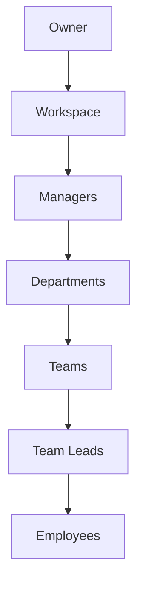

## 3. End-to-End Business Workflow

The core business logic dictates the lifecycle of workspace initialization, resource allocation, and task execution. 

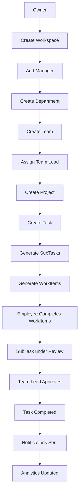

## 4. Authentication Architecture

The Authentication Layer utilizes a dual-token mechanism (JWT) paired with cryptographic verification for initial identity negotiation.

### Authentication Flow

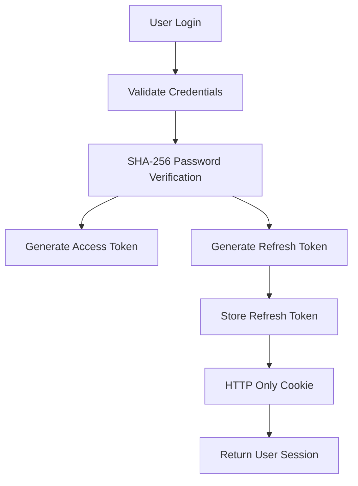

### Access Token Flow

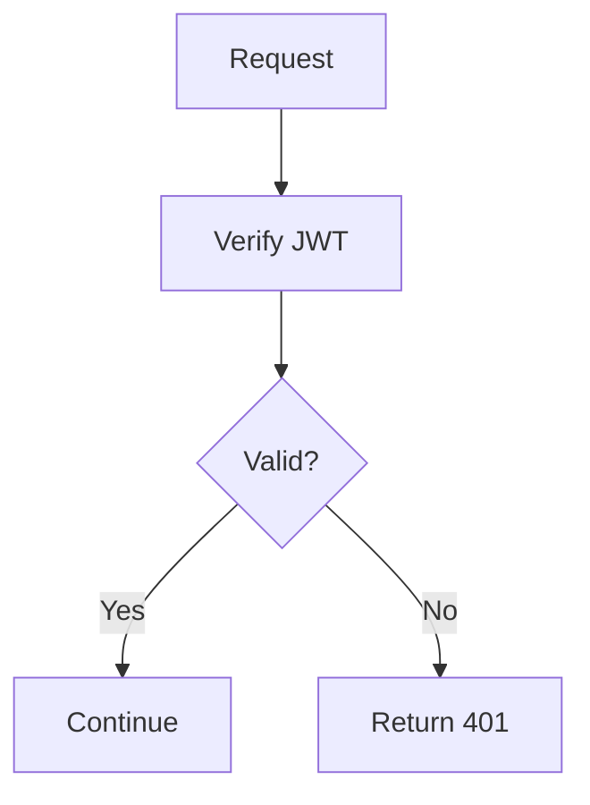

### Refresh Token Flow

Session Management handles seamless token rotation to minimize access interruption.

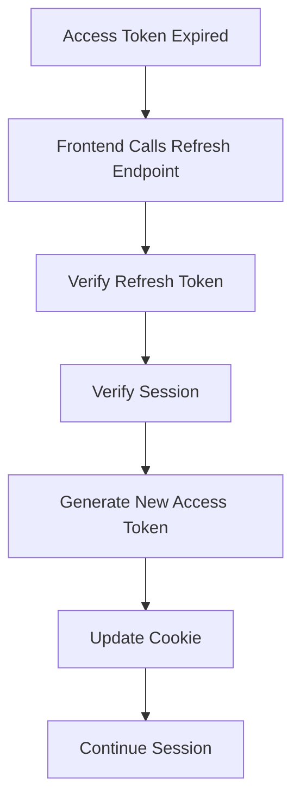

## 5. Caching Strategy

The system utilizes Redis as an in-memory data store to minimize relational database saturation during high-frequency read operations.

### Redis Cache Flow

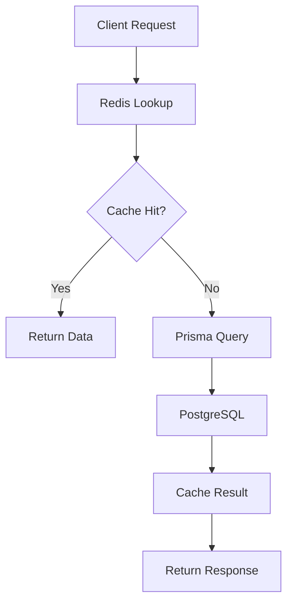

## 6. Event-Driven Communication

Event propagation is localized to connected clients through a centralized WebSocket interface.

### Notification Architecture

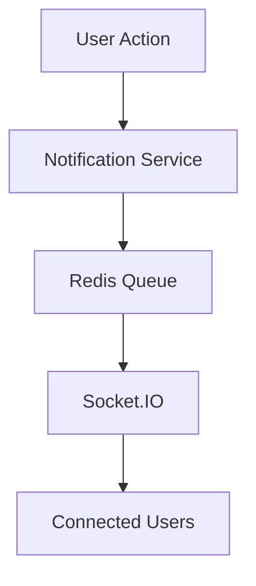

### Socket.IO Workflow

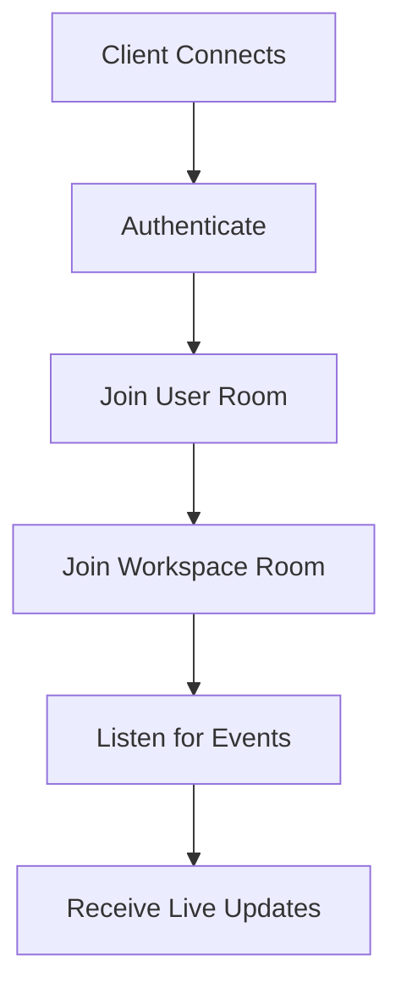

## 7. AI Suggestion Workflow

The Service Layer integrates with the Gemini API to orchestrate intelligent decomposition of complex project definitions.

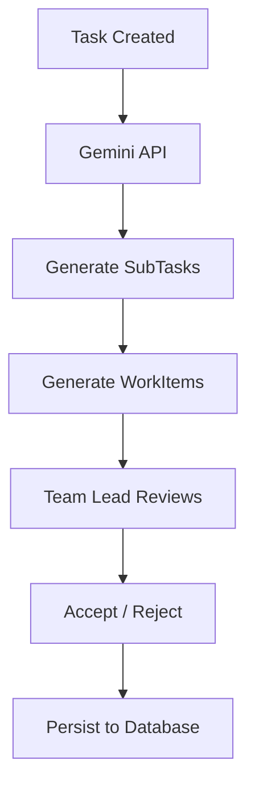

## 8. Request Lifecycle

The API request lifecycle enforces strict boundary separation across middleware and service layers.

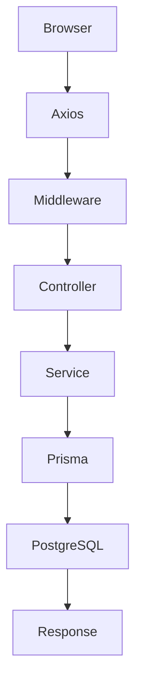

## 9. Database Architecture

The persistence layer guarantees ACID compliance and referential integrity.

### Database ER Diagram

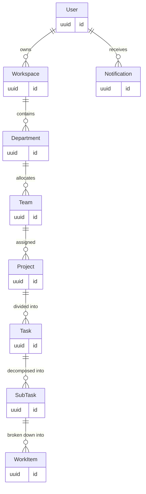

## 10. Production Deployment

The infrastructure leverages a distributed set of managed platforms for high availability and horizontal scalability.

### Deployment Architecture

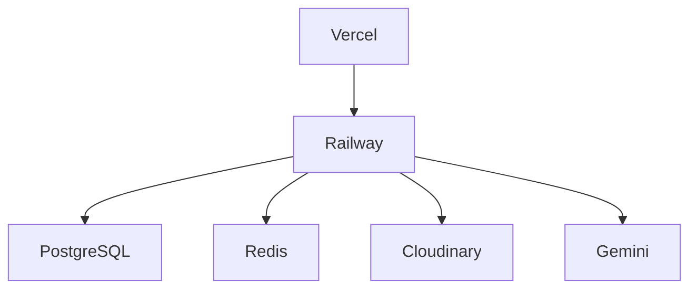

## 11. Specifications and Requirements

### Tech Stack

| Domain | Technology |
| --- | --- |
| Frontend | React, Vite |
| UI Framework | Tailwind CSS |
| Backend API | Node.js, Express.js |
| Database | PostgreSQL |
| ORM | Prisma |
| Caching & Pub/Sub | Redis |
| Real-Time Engine | Socket.IO |
| AI Integration | Gemini API |
| Media Storage | Cloudinary |

### Feature Matrix

| Feature | Subsystem | Status |
| --- | --- | --- |
| JWT Authentication | Security Layer | Production Ready |
| Role-Based Access Control | Authorization Layer | Production Ready |
| Telemetry & Broadcasting | Event-Driven Communication | Production Ready |
| AI Auto-Generation | Service Layer | Production Ready |
| Distributed Object Storage | Asset Delivery | Production Ready |

### Role Permissions

| Role | Scope | Permissions |
| --- | --- | --- |
| Owner | Workspace | Full Workspace Configuration, Global Privileges |
| Manager | Department | Manage Projects, Allocate Teams |
| Team Lead | Project | Manage SubTasks, Review WorkItems |
| Employee | WorkItem | Execute WorkItems, Update Status |

### Environment Variables

| Variable | Requirement | Description |
| --- | --- | --- |
| `DATABASE_URL` | Required | Relational database connection string. |
| `ACCESS_TOKEN_SECRET` | Required | Cryptographic secret for JWT signing. |
| `REFRESH_TOKEN_SECRET` | Required | Cryptographic secret for session rotation. |
| `REDIS_URL` | Optional | Cache endpoint configuration. |
| `GEMINI_API_KEY` | Required | Access token for AI orchestration layer. |
| `CLOUDINARY_URL` | Required | Connection string for media persistence. |

### API Overview

| Module | Protocol | Pattern | Responsibility |
| --- | --- | --- | --- |
| Auth | REST | `/api/auth/*` | Session Management |
| Users | REST | `/api/users/*` | Identity Configuration |
| Workspaces | REST | `/api/workspace/*` | Resource Boundary Management |
| Projects | REST | `/api/project/*` | Scope Allocation |
| Sockets | WSS | `/socket.io/*` | Event Telemetry |

### Deployment Checklist

| Phase | Task | Status |
| --- | --- | --- |
| Security | Configure Cross-Origin Resource Sharing (CORS). | Pending |
| Security | Disable verbose error reporting on public endpoints. | Pending |
| Infrastructure | Apply Prisma schema migrations to production RDS. | Pending |
| Infrastructure | Initialize Upstash Redis instance bounds. | Pending |
| Telemetry | Implement application logging aggregation. | Pending |

## 12. Folder Structure

```text
Synapse/
├── backend/
│   ├── src/
│   ├── controllers/
│   ├── routes/
│   ├── middleware/
│   ├── services/
│   ├── prisma/
│   └── sockets/
├── frontend/
│   ├── components/
│   ├── hooks/
│   ├── pages/
│   ├── context/
│   ├── services/
│   └── utils/
└── README.md
```
